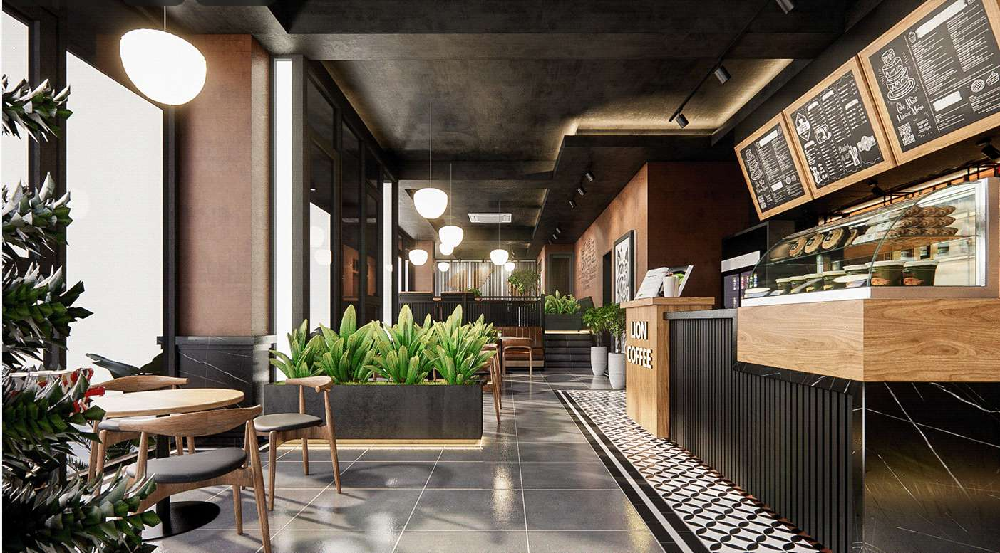

## Введение
Это просто проверка, как будет публиковаться заметка в телеге без картинки в шапке. 
Заметки, касательно проекта. Здесь я заменил стандартную ссылку обсидиана на картинку на ссылку, понятную HUGO

 
**Ghjdthrf pthglgm;lmb** dlklkjldfv *l;lk;dfvmf dlklkdfv* <u>klkdfkjlkkjlkjldf</u> 
$$
E=MC^2
$$

Вставка картинки по ссылке

<footer>Footer text</footer>

